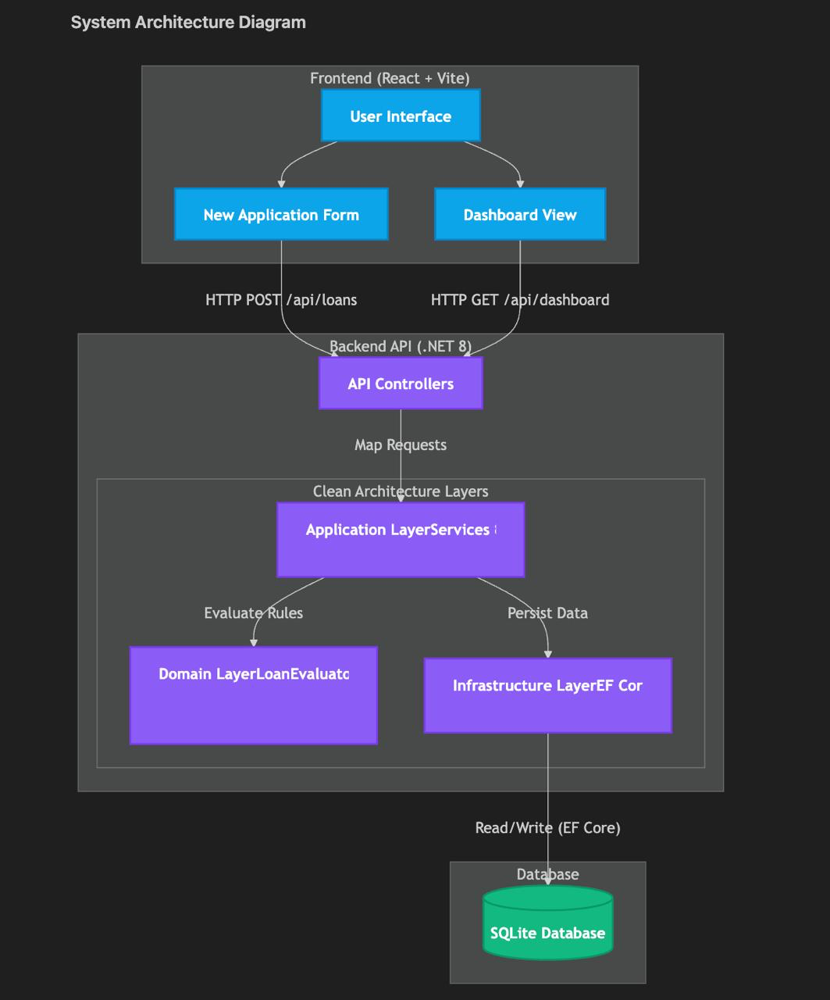

# Lending Decision Platform

A full-stack lending decision platform that evaluates loan applications using configurable LTV and credit-score rules, provides explainable decisions, and presents application statistics through a React web interface.

## 1. Project Overview
The Lending Decision Platform is a full-stack web application designed to process loan application data:
- Loan Amount
- Asset Value
- Credit Score

The application calculates the Loan-to-Value (LTV) ratio and evaluates the application against the defined lending rules to produce an immediate **Approved** or **Declined** decision.

The platform is built with a C# .NET 8 backend and a React/TypeScript frontend.

## 2. Features
- **Live Decision Engine**: Evaluates loan applications against the defined loan amount, LTV, and credit-score requirements.
- **Detailed Decision Explanations**: Explains why an application was approved or declined, including the relevant rules and conditions.
- **Decision Simulator**: Provides hypothetical mathematical scenarios that show how changes to values such as asset value or loan amount could affect LTV eligibility.
- **Live LTV Preview**: Calculates and displays the estimated LTV dynamically while entering loan application details. *(Note: The backend remains the authoritative source for the final LTV and lending decision.)*
- **Application Ledger**: Provides a historical view of submitted applications with filtering and sorting capabilities.
- **Real-Time Dashboard Statistics**: Displays Total applicants, Successful applicants, Declined applicants, Total capital written, and Mean LTV.

## 3. Technology Stack
**Backend**
- C# .NET 8
- ASP.NET Core Web API
- Entity Framework Core
- SQLite
- xUnit
- Moq

**Frontend**
- React 18
- TypeScript / JavaScript
- Vite
- Tailwind CSS
- Recharts (for Dashboard visualisations)

## 4. Architecture
The project follows a Domain-Driven Design (DDD) and Clean Architecture approach.
The core lending rules reside in the `Lending.Domain` project and remain independent of the database and presentation layers. The React frontend is decoupled from the lending rules and acts as a client of the backend API.

### System Architecture Diagram


## 5. Folder Structure
```text
Lending-Decision-Platform/
├── backend/
│   ├── LendingPlatform.Api/
│   ├── LendingPlatform.Application/
│   ├── LendingPlatform.Domain/
│   ├── LendingPlatform.Infrastructure/
│   └── tests/
│       ├── LendingPlatform.Api.Tests/
│       ├── LendingPlatform.Domain.Tests/
│       └── LendingPlatform.Infrastructure.Tests/
├── frontend/
│   └── lending-platform-ui/
│       ├── src/
│       │   ├── components/
│       │   ├── pages/
│       │   ├── services/
│       │   └── utils/
│       ├── package.json
│       └── ...
├── AI_LOG.md
├── README.md
└── .gitignore
```

## 6. Business Rules
**General Loan Limits**
| Condition | Decision |
| :--- | :--- |
| Loan < £100,000 | Declined |
| Loan > £1,500,000 | Declined |

**High-Value Loans** (For loans ≥ £1,000,000)
- LTV must be 60% or less
- Credit score must be 950 or greater
*(Both conditions must be satisfied.)*

**Standard Loans** (For loans < £1,000,000)
| LTV | Required Credit Score |
| :--- | :--- |
| LTV < 60% | ≥ 750 |
| LTV < 80% | ≥ 800 |
| LTV < 90% | ≥ 900 |
| LTV ≥ 90% | Declined |

## 7. LTV Calculation
Loan-to-Value is calculated using: `LTV = (Loan Amount / Asset Value) × 100`

**Example:**
- Loan Amount = £750,000
- Asset Value = £1,200,000
- LTV = (750,000 / 1,200,000) × 100 = 62.50%

The backend uses `decimal` arithmetic for LTV and monetary calculations. The frontend may display a live LTV preview, but the backend recalculates the value before making the final decision.

**LTV Boundary Interpretation**
For loans below £1,000,000, the implementation interprets the specified strict `<` conditions as:
- `0% ≤ LTV < 60%`
- `60% ≤ LTV < 80%`
- `80% ≤ LTV < 90%`
- `LTV ≥ 90%`

For loans greater than or equal to £1,000,000: `LTV ≤ 60%` and `Credit Score ≥ 950`.
Borderline LTV values are evaluated using the calculated decimal value rather than being pre-rounded before rule evaluation.

## 8. API EndPoints
- **Submit Loan Application**: `POST /api/loans` - Submits a new loan application and evaluates the lending rules.
- **Retrieve Applications**: `GET /api/loans` - Returns persisted loan applications (paginated).
- **Retrieve Application Details**: `GET /api/loans/{id}` - Returns detailed information about a specific application.
- **Dashboard**: `GET /api/dashboard` - Returns aggregated lending statistics.

## 9. Prerequisites
Install:
- .NET 8 SDK
- Node.js v18+
- Git

## 10. Local Setup
Clone the repository:
```bash
git clone https://github.com/mungaseashu/Lending-Decision-Platform---Thrive
cd Lending-Decision-Platform---Thrive
```

**Backend Setup**
Navigate to the backend directory:
```bash
cd backend/LendingPlatform.Api
dotnet run
```
The backend runs at `http://localhost:5004`.

**Frontend Setup**
Open a new terminal. Navigate to the frontend:
```bash
cd frontend/lending-platform-ui
npm install
npm run dev
```
The frontend runs at `http://localhost:5173`.

## 11. Database
The application uses SQLite with Entity Framework Core. No separate SQL Server or PostgreSQL installation is required. The SQLite database is configured by the backend and is created automatically.

## 12. Testing
Run all backend tests:
```bash
cd backend
dotnet test
```
The current implementation contains a comprehensive suite of xUnit tests covering business rules, validation, boundary conditions, and related functionality (including exact boundary testing for LTV thresholds).

## 13. Assumptions
- **Mean LTV**: The dashboard's mean LTV calculation applies to *all* submitted applicants (approved and declined).
- **Total Value of Loans Written**: The total value of loans written applies *only* to approved applications.
- **Backend as Source of Truth**: All final validation, LTV calculation, and lending decisions are performed strictly by the backend.

## 14. Production Considerations
This project is designed as a technical assessment and is not intended to represent a production-ready lending platform. For a production implementation, improvements would include:
- PostgreSQL or SQL Server
- Authentication and authorization (JWT/Identity)
- Audit logging & Structured application logging
- Monitoring and alerting
- CI/CD pipelines
- Database backup and recovery
- API versioning & Rate limiting

## 15. AI-Assisted Development
AI tools (Google Gemini) were used as engineering assistants.
AI assistance was used for:
- Requirements analysis
- Architecture design scaffolding
- Business-rule boundary testing
- UI boilerplate (Tailwind)
AI-generated suggestions were strictly reviewed, challenged on boundary constraints, and manually tested rather than blindly accepted. (See `AI_LOG.md` for full details).
